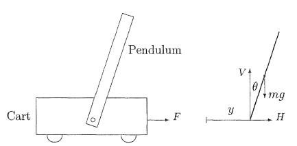

# MPC-test

使用MPC完成倒立摆控制问题

## 1. 建模

考虑如下图所示的平面倒立摆系统。摆杆的支点固定于可以水平移动的小车上。



设：

- 小车质量为 $M$
- 摆杆质量为 $m$
- 摆杆质心到支点距离为 $L$
- 摆杆绕质心转动惯量为 $I$
- 摆杆相对于竖直方向夹角为 $\theta$（顺时针方向为正）
- 小车水平位移为 $y$
- 小车受到水平推力 $F$
- 小车阻尼系数为 $k$
- 重力加速度为 $g$

摆杆受到三个外力：

- 重力 $mg$
- 支点水平方向作用力 $H$
- 支点竖直方向作用力 $V$

---

则系统方程最终可提取为如下内容：

```math
$$
\begin{cases}
(I+mL^2)\ddot{\theta}
=
mgL\sin\theta
-
mL\cos\theta\,\ddot{y}, \\[8pt]

(M+m)\ddot{y}
+
mL\cos\theta\,\ddot{\theta}
-
mL\sin\theta\,\dot{\theta}^{2}
+
k\dot{y}
=
F.
\end{cases}
$$
```

> 推导过程详见assets

## 2. 目前项目架构

目前已经实现使用级联PID进行倒立摆的镇定控制，即控制倒立摆位于原点且摆杆竖直向上（y=0,θ=0）

项目架构如下：

```bash
├── assets                         # 静态资源
│   ├── 推导过程
│   │   ├── cart-pole.md           # 基于刚体动力学推导一阶倒立摆
│   │   └── lagrange.md            # 基于拉格朗日方程推导一阶倒立摆
│   └── images
│       └── cart-pole.png
├── bin                            # 存放可执行二进制文件
├── build                          # 存放构建文件
├── CMakeLists.txt
├── config
│   └── cart_pole.yaml             # 参数
├── include
│   └── pid_cart_pole
│       ├── cart_pole.hpp          # 一阶倒立摆模型
│       ├── config_loader.hpp      # 参数加载工具
│       └── pid_controller.hpp     # pid控制器
├── README.md
├── README.pdf
├── scripts
│   └── build.sh                   # 构建、编译脚本
└── src
    └── pid_cart_pole
        ├── cart_pole.cpp
        ├── config_loader.cpp
        ├── opencv_cart_pole_demo.cpp
        └── pid_controller.cpp
```

## 3. 具体任务

- 现在的级联PID参数已经较为精确，可以尝试进行调参，体会级联PID调参的过程
- 使用acados实现MPC控制算法，最终实现对倒立摆系统的镇定控制，要求：
  - 学习状态空间的概念，思考如何定义状态空间（可参考已有的pid），为什么这样定义
  - 推导相关的MPC公式，呈现一份报告（可以手写公式也可以尝试各种电子版输入公式的方式）
  - **最终生成的可执行程序为C/C++生成**
